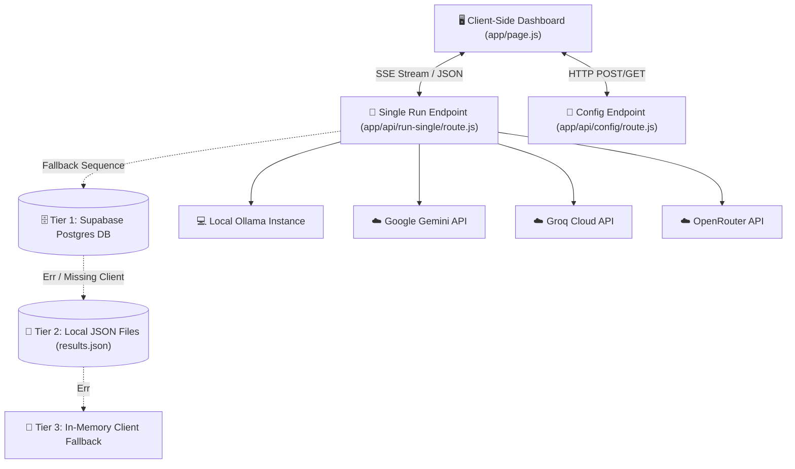

# Research Documentation: System Architecture & Algorithmic Logic of AI Benchmark Analyzer

This document provides a comprehensive technical breakdown of the **AI Benchmark Analyzer** platform, structured to support the writing, analysis, and publication of research papers. It explains the system's end-to-end architecture, communication protocols, dynamic routing engines, fallback policies, client-side streaming state buffers, and statistical calculation mechanisms.

---

## 1. High-Level System Architecture

The AI Benchmark Analyzer is designed as a modular, low-latency benchmarking framework. It evaluates model responsiveness and throughput by connecting a React-based frontend directly to a Serverless backend routing layer.



### 1.1 Tech Stack
* **Framework:** Next.js (App Router) using serverless API endpoints.
* **Styling & Layout:** Tailwind CSS & Raw CSS (`globals.css`) for responsive, interactive dashboard design.
* **Database Layer:** PostgreSQL hosted on Supabase (Tier 1) for historical data capture and persistent tracking.
* **Caching & Fallback:** Local Node file system (`fs`) modules writing to `config.json` and `results.json` (Tier 2).
* **Communication Protocol:** HTTP POST requests returning progressive `text/event-stream` payloads using Server-Sent Events (SSE).

---

## 2. Real-Time Telemetry & Latency Calculation Engine

To isolate provider inference latency from raw network connection overhead, the benchmarking client and route handler record time indices during stream generation.

### 2.1 Mathematical Formulations

1. **Benchmark Clock Initialization ($t_{\text{start}}$)**:
   The timestamp recorded in Unix epoch milliseconds immediately before the backend fires the HTTP fetch request to the respective LLM provider:
   $$t_{\text{start}} = \text{Date.now()}$$

2. **Time to First Token ($\text{TTFT}$)**:
   The duration elapsed until the first chunk of text content arrives at the server stream reader:
   $$\text{TTFT} = t_{\text{first}} - t_{\text{start}} \quad [\text{ms}]$$
   *Where $t_{\text{first}}$ is the timestamp recorded during the first execution loop in which a non-empty token is decoded.*

3. **Wall Clock Duration ($D$)**:
   The complete connection lifetime from request dispatch to stream closure ($t_{\text{end}}$):
   $$D = \max(1, t_{\text{end}} - t_{\text{start}}) \quad [\text{ms}]$$

4. **Token Generation Throughput ($\text{TPS}$)**:
   Calculated dynamically based on the total token count ($N_{\text{tokens}}$) generated during the run:
   $$\text{TPS} = \frac{N_{\text{tokens}}}{D / 1000} \quad [\text{Tokens/second}]$$

5. **Token Count Quantification ($N_{\text{tokens}}$)**:
   Where possible, the parser reads the native token usage metadata directly from the model provider's trailing stream packet:
   * **Gemini:** `parsed.usageMetadata.candidatesTokenCount`
   * **Groq / OpenRouter:** `parsed.usage.completion_tokens`
   * **Ollama:** `chunk.eval_count`
   
   If usage metadata is absent or missing, the system utilizes a statistical character-to-token ratio heuristic:
   $$N_{\text{tokens}} = \max\left(1, \left\lfloor \frac{\text{length}(S_{\text{output}})}{4} \right\rfloor\right)$$

---

## 3. Multi-Provider Stream Routing Logic

The core execution endpoint [`app/api/run-single/route.js`](file:///d:/PROJECT/ai-benchmark/app/api/run-single/route.js) uses prefix routing to separate model calls and format downstream output into a standardized, unified SSE stream.

### 3.1 Model Prefix Matching
The routing engine analyzes the incoming `model` name string parameter:
* **`gemini-*`** $\rightarrow$ Dispatched to the Google Gemini API.
* **`groq/*`** $\rightarrow$ Truncates the `groq/` prefix and routes to the Groq Chat Completions endpoint.
* **`openrouter/*`** $\rightarrow$ Truncates the `openrouter/` prefix and forwards to the OpenRouter gateway.
* **Default / Custom Prefix** $\rightarrow$ Assumed to be a local or remote Ollama deployment (managed via the `@ollama/sdk` or network bindings).

### 3.2 Standardized Event Envelope
Regardless of the provider backend, all generated chunks are wrapped and flushed using the following SSE stream protocol event types:
```javascript
sendEvent('log', null, text);     // Progressive raw token content
sendEvent('output', metricsObj);  // Structured final payload containing latency, TTFT, TPS, and status
```

---

## 4. Rate-Limiting & Network Resilience Logic

To counter API rate limits (`429 Too Many Requests`) during parallel iterations, the backend implements an autonomous retry mechanism with dynamic delays.

### 4.1 Retry Delay Formulation
Upon receiving a `429` status code, the router handles retry delays depending on the provider API:

1. **Google Gemini:**
   Queries the response's error details object for a specific `RetryInfo` record:
   $$\text{Delay}_{\text{retry}} = \text{parseFloat}(\text{retryDelaySeconds}) \times 1000 + 1000 \quad [\text{ms}]$$
   *Falls back to a default of 10,000ms if no headers exist.*

2. **Groq / OpenRouter:**
   Attempts to read the HTTP `retry-after` header. If absent, the engine scans the body error payload message using regex patterns looking for `try again in (value)(unit)`:
   $$\text{Delay}_{\text{retry}} = \begin{cases} 
      \text{value} \times 1000 + 1000 & \text{if unit is seconds} \\
      \text{value} & \text{if unit is milliseconds} 
   \end{cases}$$

3. **Retry Attempts Cap:**
   The router enforces a hard ceiling of $5$ attempts. If all attempts return rate limits, the stream throws a final execution exception.

---

## 5. Iterative Batch Execution Queue

To obtain statistically significant performance benchmarks, the frontend client [`app/page.js`](file:///d:/PROJECT/ai-benchmark/app/page.js) queues multiple evaluations across a matrix of $M$ models and $I$ iterations.

### 5.1 Concurrency & Task Scheduling
* **Sequential Iterations:** Iterations for a single model are executed sequentially to avoid immediate rate limit triggers.
* **Total Tasks ($N_{\text{total}}$):**
  $$N_{\text{total}} = M \times I$$
* **Live Completion Progress Calculation ($P_{\text{live}}$):**
  $$P_{\text{live}} = \min\left(100, \left\lfloor \frac{C_{\text{completed}}}{N_{\text{total}}} \times 100 + \frac{P_{\text{stream}}}{N_{\text{total}}} \right\rfloor\right)$$
  *Where $C_{\text{completed}}$ is the number of completed iteration runs, and $P_{\text{stream}} \in [0, 100]$ represents the completion percentage of the active SSE stream.*

### 5.2 Statistical Metrics Aggregation
After executing $K \le I$ successful iterations (excluding failed/timeout runs), the engine calculates the average performance metrics:
$$\bar{X}_{\text{TTFT}} = \frac{1}{K} \sum_{k=1}^{K} \text{TTFT}_k$$
$$\bar{X}_{\text{TPS}} = \frac{1}{K} \sum_{k=1}^{K} \text{TPS}_k$$
$$\bar{X}_{\text{Duration}} = \frac{1}{K} \sum_{k=1}^{K} D_k$$

---

## 6. Client-Side SSE Stream Parser & State Buffer

The frontend reads incoming streams character-by-character. To prevent UI lockups and parsing crashes due to fragmented packages, a local text buffer keeps incomplete lines.

```
[ Raw Byte Chunks from Network ] 
              │
              ▼
[ TextDecoder (UTF-8) ]
              │
              ▼
[ String Buffer Cache ] ──► Split by newline ('\n')
              │
              ├─► Incomplete Trailing Line ──► Keep in String Buffer Cache
              │
              └─► Complete Lines
                         │
                         ▼
                   [ JSON.parse ] ──► Dispatch by 'type'
                                           │
         ┌───────────────────┬─────────────┴─────────────┬──────────────────┐
         ▼                   ▼                           ▼                  ▼
     ['log']             ['progress']                ['output']         ['result']
         │                   │                           │                  │
   Append Token        Update Progress             Store Metrics      Update Charts
   to Terminal         Bar State                   and Output Text    & Analytics
```

1. **Chunk Buffering:**
   ```javascript
   const reader = response.body.getReader();
   const decoder = new TextDecoder();
   let buffer = "";
   
   while (true) {
     const { done, value } = await reader.read();
     if (done) break;
     
     buffer += decoder.decode(value, { stream: true });
     const lines = buffer.split("\n");
     buffer = lines.pop(); // Retain incomplete line fragments in the buffer
     
     for (const line of lines) {
       if (line.startsWith("data: ")) {
         const parsed = JSON.parse(line.slice(6));
         // Dispatch parsed events (log, progress, output, result) to state variables
       }
     }
   }
   ```
2. **Dynamic UI Rendering:**
   * **`log` events:** Directly appended to a text terminal state.
   * **`output` events:** Dispatched to the charting framework (updating performance curves in real time).

---

## 7. Multi-Tier Data Persistence

To guarantee absolute availability of metrics logs, the application implements a failover-safe data persistence pipeline:

```
[ Run Metric Generated ]
           │
           ▼
┌──────────────────────────────────────────────┐
│ Tier 1: Supabase PostgreSQL                  │ ──► Success (Saved to cloud)
└──────────────────────┬───────────────────────┘
                       │ (Network Timeout / Conn Error)
                       ▼
┌──────────────────────────────────────────────┐
│ Tier 2: Local JSON Backup Storage            │ ──► Success (Saved to results.json)
└──────────────────────┬───────────────────────┘
                       │ (Write Permission / FS Error)
                       ▼
┌──────────────────────────────────────────────┐
│ Tier 3: In-Memory Client State               │ ──► Saved in local React memory
└──────────────────────────────────────────────┘
```

1. **Supabase PostgreSQL Interface (Tier 1):**
   Attempts to write the benchmark iteration run data directly to the remote tables via the client in [`lib/supabase.js`](file:///d:/PROJECT/ai-benchmark/lib/supabase.js).
2. **Local Disk Caching (Tier 2):**
   If database queries fail or connection configurations are missing, the server redirects outputs to local JSON flat files using synchronous write operations:
   ```javascript
   fs.writeFileSync(path.join(process.cwd(), 'results.json'), JSON.stringify(resultsBuffer));
   ```
3. **In-Memory fallback (Tier 3):**
   If local writes fail due to environment permission restrictions, metrics are retained solely inside the client's React state scope to prevent crash loops.

---

## 8. AI Recommendation & Selection Heuristic

The platform features an automated recommendation engine that helps developers choose the best model configuration based on their operational priorities:

| Selection Criteria | Optimization Function | Target Metric | Recommended Archetype |
| :--- | :--- | :--- | :--- |
| **Fastest Response** | $\arg\min(\text{TTFT})$ | Time to First Token | Low-latency inference engines (e.g., Groq) |
| **Best Coding** | Qualitative Ranking | Output Accuracy & Syntax | High-reasoning models (e.g., Gemini Pro) |
| **Balanced Performance** | Harmonic Mean of Speed & Accuracy | $\frac{2 \times \text{TPS} \times \text{Accuracy}}{\text{TPS} + \text{Accuracy}}$ | Mid-tier optimized models |

This matrix calculates recommendations on the fly as new runs are executed, presenting a clear summary card to the user.
