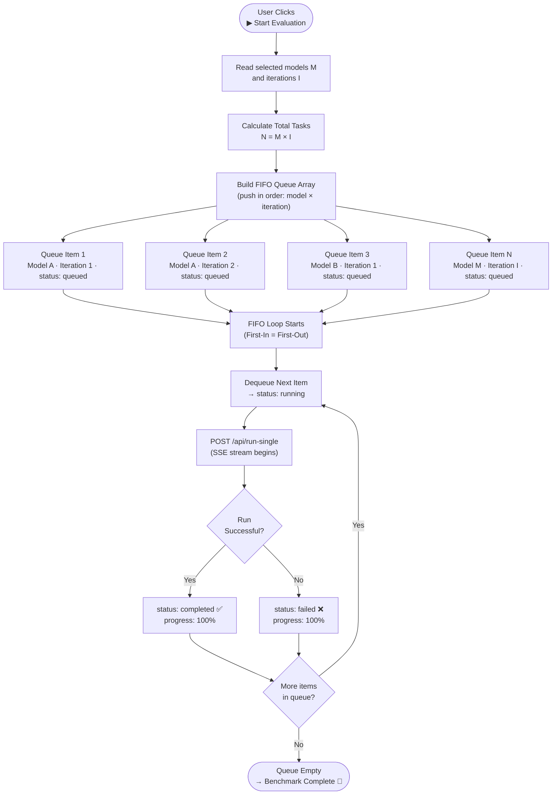
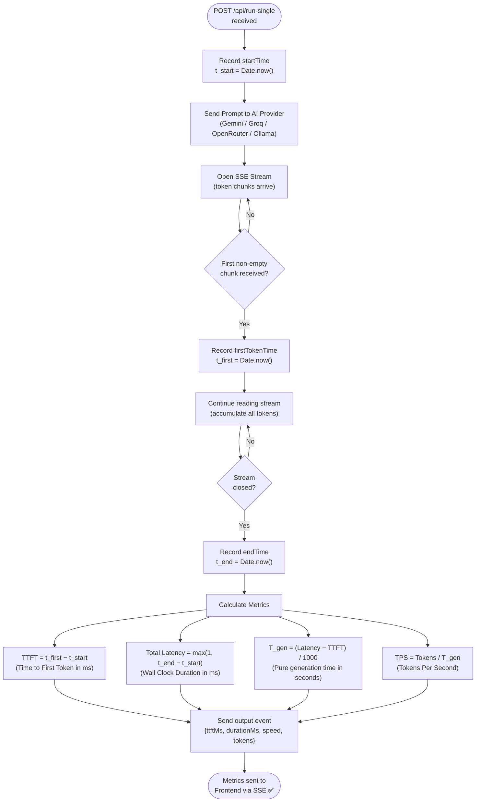
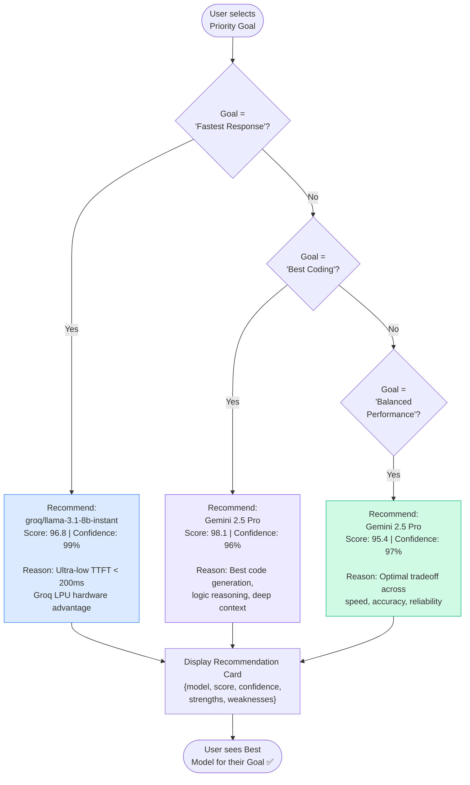
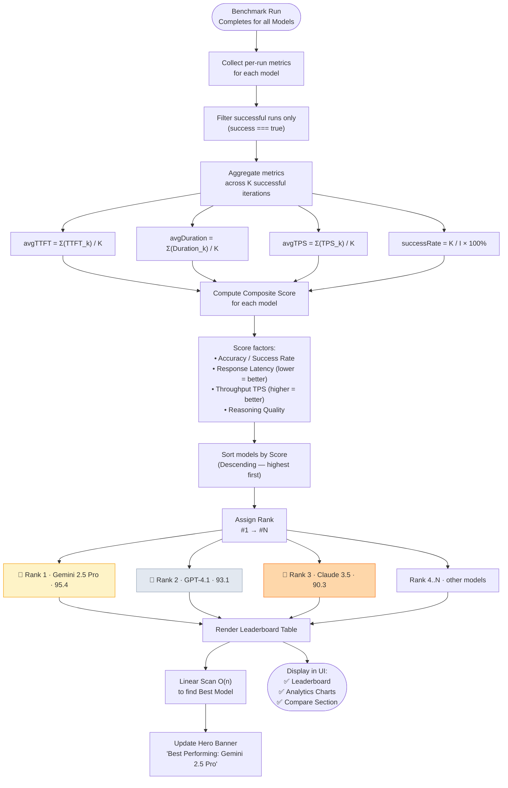

# Algorithm Workflow Diagrams — AI Benchmark Analyzer

---

## Algorithm 1 — FIFO Queue (Batch Execution Queue)

---

## Algorithm 2 — Latency Calculation

---

## Algorithm 3 — Heuristic-Based Model Selection

---

## Algorithm 4 — Scoring & Ranking

---

## Combined — End-to-End Algorithm Flow

```mermaid
flowchart LR
    User(["👤 User"])

    subgraph ALG3["Algorithm 3\nHeuristic Model Selection"]
        HS["Select Goal\n→ Get Recommendation"]
    end

    subgraph ALG1["Algorithm 1\nFIFO Queue"]
        Q1["Build ordered queue\nM models × I iterations"]
        Q2["Process FIFO\none by one"]
    end

    subgraph ALG2["Algorithm 2\nLatency Calculation"]
        LC1["t_start = Date.now()"]
        LC2["→ AI Provider API"]
        LC3["t_first = first token"]
        LC4["t_end = stream close"]
        LC5["TTFT · Latency · TPS"]
    end

    subgraph ALG4["Algorithm 4\nScoring & Ranking"]
        SR1["Aggregate avg metrics"]
        SR2["Compute Score"]
        SR3["Sort & Rank models"]
        SR4["Leaderboard Table"]
    end

    User --> ALG3
    ALG3 --> ALG1
    ALG1 --> ALG2
    ALG2 --> ALG4
    ALG4 --> User
```

