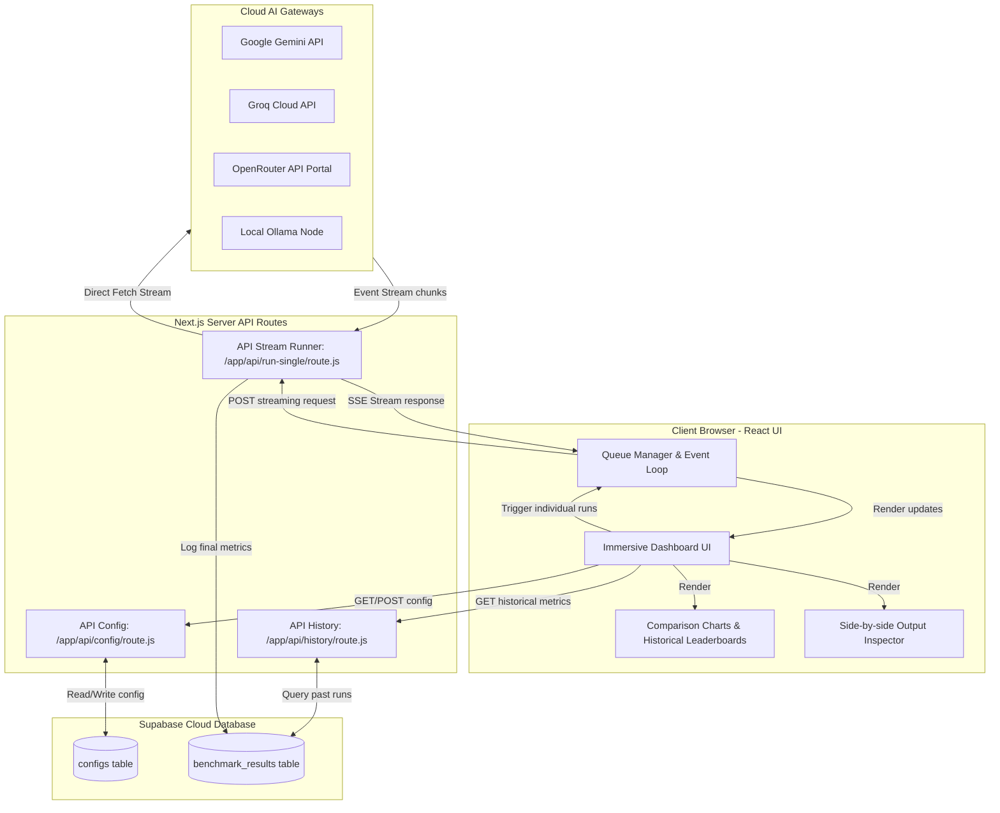

# Migrate AI Benchmark Analyzer to Next.js (with Supabase DB Integration)

This plan outlines the migration of the AI Benchmark Analyzer codebase from a legacy custom Node.js server to a Next.js App Router hybrid architecture. It integrates **Supabase Database** for serverless-compatible data persistence, database-backed configurations, and a permanent history of model performance metrics. 

Additionally, this plan includes a major **Immersive Split-Screen UI Redesign** to deliver an incredibly attractive, modern, full-viewport user experience while maintaining a simplified interface by **hiding API key configurations** (relying on server-side environment variables).

## Proposed Supabase-Integrated Architecture

The browser dashboard orchestrates runs via backend API endpoints. The Next.js backend executes the LLM runs and logs results directly to **Supabase Database**:



---

## Database Schema (SQL)

We will set up two tables in Supabase. You can execute this SQL in the Supabase SQL Editor:

```sql
-- Table to store global benchmark configurations
CREATE TABLE IF NOT EXISTS configs (
  id text PRIMARY KEY DEFAULT 'active_config',
  updated_at timestamp with time zone DEFAULT timezone('utc'::text, now()) NOT NULL,
  models text[] NOT NULL,
  tasks jsonb DEFAULT '[]'::jsonb NOT NULL,
  iterations integer DEFAULT 2 NOT NULL,
  env jsonb DEFAULT '{}'::jsonb NOT NULL
);

-- Table to store individual benchmark run results
CREATE TABLE IF NOT EXISTS benchmark_results (
  id uuid DEFAULT gen_random_uuid() PRIMARY KEY,
  session_id uuid NOT NULL,
  created_at timestamp with time zone DEFAULT timezone('utc'::text, now()) NOT NULL,
  model text NOT NULL,
  task text NOT NULL,
  ttft_ms integer NOT NULL,
  latency_ms integer NOT NULL,
  tokens integer NOT NULL,
  speed_tps numeric NOT NULL,
  success boolean NOT NULL,
  response_text text,
  error_message text
);
```

---

## User Review Required

> [!IMPORTANT]
> **Corrected File Structure (No `src/` folder)**
> The existing Next.js project is structured using the root `app/` folder (e.g., `app/page.js`), not `src/app/`. The implementation will write directly to root folders to maintain consistency.

> [!NOTE]
> **Graceful Local Fallback**
> If Supabase environment variables are missing, the server APIs will automatically fall back to using a local `config.json` and a local `results.json` file on the filesystem. This ensures the app runs out-of-the-box in local-only environments.

---

## Open Questions

> [!WARNING]
> **Complete Layout Redesign Options**
> Since you requested *another* UI design and layout change to be "more attractive," I propose a radical shift away from the grid/bento box. I propose an **Immersive Split-Screen Layout** (often seen in high-end design tools like Figma or Spline). 

> [!NOTE]
> **"Immersive Split-Screen" Aesthetic**
> The screen will be split: a sleek, frosted-glass control panel docked permanently to the left (taking up 30% of the screen height-wise), and a massive, edge-to-edge visualization area on the right where the charts and live monitor expand to fill the available space. The entire background will have a stunning, bright animated gradient mesh. 
> Does this sound like the "attractive layout" you are looking for, or do you have a specific website layout in mind that I can emulate?

---

## Proposed Changes

### Configuration and Environment Setup

#### [MODIFY] [package.json](file:///d:/PROJECT/ai-benchmark/package.json)
- Add `@supabase/supabase-js`, `chart.js`, and `ollama` package dependencies.

#### [NEW] [.env.local](file:///d:/PROJECT/ai-benchmark/.env.local)
- Define `NEXT_PUBLIC_SUPABASE_URL` and `NEXT_PUBLIC_SUPABASE_ANON_KEY`.
- Define fallback server-side API keys (`GEMINI_API_KEY`, `GROQ_API_KEY`, `OPENROUTER_API_KEY`, `OLLAMA_API_KEY`, `OLLAMA_HOST`) to simplify local execution without manual form entries.

#### [NEW] [lib/supabase.js](file:///d:/PROJECT/ai-benchmark/lib/supabase.js)
- Instantiate the Supabase JS client helper. Return `null` if environment variables are not set (triggering local fallback mode).

---

### Backend API Routes

#### [NEW] [app/api/config/route.js](file:///d:/PROJECT/ai-benchmark/app/api/config/route.js)
- `GET`: Reads the active config. If Supabase client is available, it pulls the row with `id = 'active_config'`. Otherwise, it reads from a local `config.json` file. If neither is configured, returns default models and tasks.
- `POST`: Writes/upserts the active config. If Supabase client is available, writes to the `configs` table. Otherwise, writes to a local `config.json` file.

#### [NEW] [app/api/run-single/route.js](file:///d:/PROJECT/ai-benchmark/app/api/run-single/route.js)
- Accept POST requests with `{ model, prompt, apiKeys, sessionId }`.
- Executes a single prompt evaluation run against the chosen model.
- Uses server-side environment variables as a fallback for API keys if they are not provided in the request body.
- Streams the generated response back to the client in real-time via Server-Sent Events (SSE).
- Saves performance metrics (`ttft_ms`, `latency_ms`, `tokens`, `speed_tps`, `success`, `response_text`, `error_message`, and `session_id`) to the Supabase database (or appends to a local `results.json` fallback file).

#### [NEW] [app/api/history/route.js](file:///d:/PROJECT/ai-benchmark/app/api/history/route.js)
- `GET`: Fetches and returns historical benchmark results. If Supabase is connected, it retrieves records from `benchmark_results` table. Otherwise, it reads from `results.json`.

---

### React Frontend Dashboard

#### [MODIFY] [app/page.js](file:///d:/PROJECT/ai-benchmark/app/page.js)
- **Split-Screen Layout**: Restructure the DOM to have two main containers: a `<aside>` for the fixed left control panel, and a `<main>` for the right side visualizations.
- **Floating Controls**: The left panel will house all configuration options in a seamless, scrollable frosted-glass pane without internal borders.
- **Hidden API Keys**: API Keys will remain hidden from the UI, pulling strictly from `.env.local`.
- Implement UI with React `useState`, `useRef`, and `useEffect`.
- **Client Queue Manager**: When the user clicks "Start Evaluation", the browser dynamically schedules sequential HTTP calls to `/api/run-single` for all chosen models, tasks, and iterations. This prevents server timeouts and supports real-time rendering.
- **Charts Visualization**: Incorporate standard `Chart.js` via canvas refs, rendering latency, TTFT, and throughput.
- **Side-by-Side Inspector**: Create a grid allowing side-by-side inspection of generated responses for the selected task.
- **Historical Analysis**: Add a tab/panel showing past run sessions, grouping runs by `session_id` and calculating averages to view progress over time.

#### [MODIFY] [app/globals.css](file:///d:/PROJECT/ai-benchmark/app/globals.css)
- **Animated Mesh Background**: Introduce a bright, moving gradient background on `body` (e.g., swirling pastels) to make it incredibly impressive.
- **Extreme Glassmorphism**: The panels will use high blur (`backdrop-filter: blur(40px)`) and semi-transparent white backgrounds (`rgba(255,255,255,0.4)`) to let the moving background shine through.
- **Full Viewport Grid**: Change `.app-main` to `display: flex; height: 100vh; overflow: hidden;` to lock the layout into the viewport and prevent full-page scrolling.

---

## Verification Plan

### Automated Tests
- Run `npm run build` to verify that Next.js successfully compiles without server-side rendering or TypeScript/lint errors.

### Manual Verification
1. **Fallback Verification**: Start the server without `.env.local` configured. Change configurations, run a test benchmark, and verify that the data persists locally to `config.json` and `results.json`.
2. **Supabase Connection**: Configure `.env.local` with Supabase credentials. Verify that configuration saves to the cloud database table, and that benchmark metrics are written successfully.
3. **SSE Streams**: Run a model execution and verify that the log console updates chunk-by-chunk.
4. **Historical Comparison**: Run multiple benchmarks and inspect the historical charts and session drop-downs to ensure correct grouping by `session_id`.
