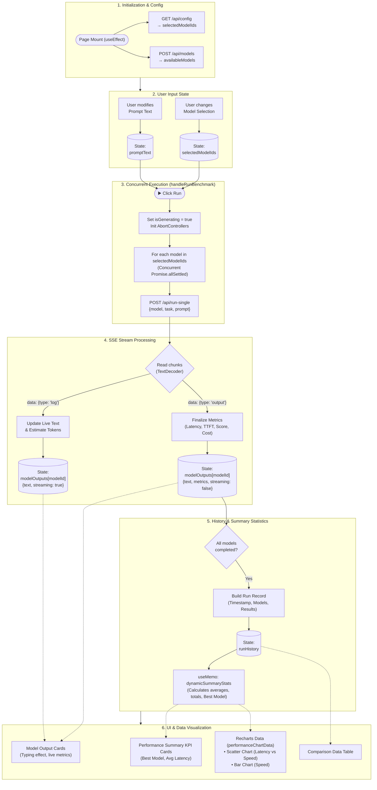

# 🎮 Playground Page — Data Flow Chart

---

## Complete Data & State Flow (`app/playground/page.js`)

---

### 🔑 Key Concepts in the Playground Data Flow:
1. **Concurrency**: Unlike the dashboard (which uses a sequential FIFO queue), the Playground uses `Promise.allSettled` to fetch all selected models *simultaneously* to demonstrate real-time visual racing.
2. **Event-Driven State**: The UI reacts instantly to `modelOutputs` state updates triggered by SSE `type: 'log'` chunks, causing the typing effect.
3. **Derived State**: Charts and leaderboard tables are fully driven by a `useMemo` hook (`dynamicSummaryStats`) that reacts to `runHistory` updates, preventing unnecessary re-renders during live streaming.
4. **AbortControllers**: Each running model has a mapped `AbortController` allowing the user to selectively halt individual models or stop all generations instantly.
