# 🗺️ AI Benchmark Analyzer — Complete Project Workflow Diagram

---

## 1. Full System Architecture

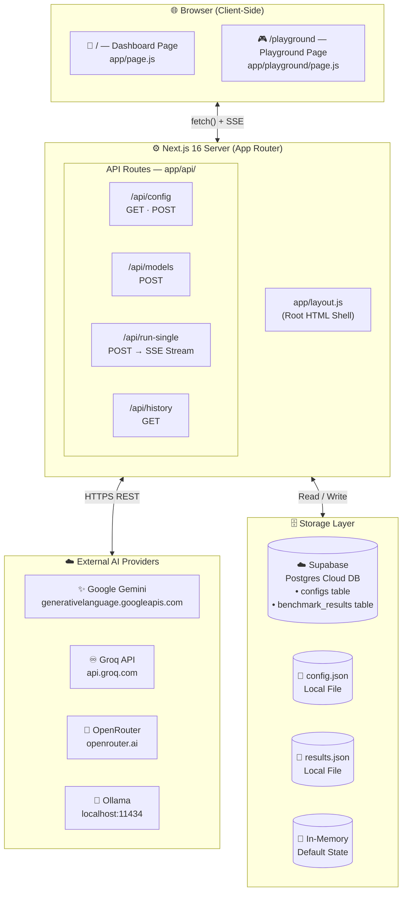

---

## 2. App Startup & Initialization

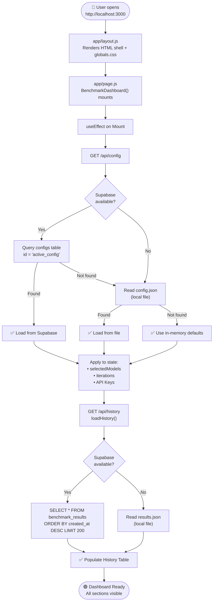

---

## 3. Navigation & Page Routing

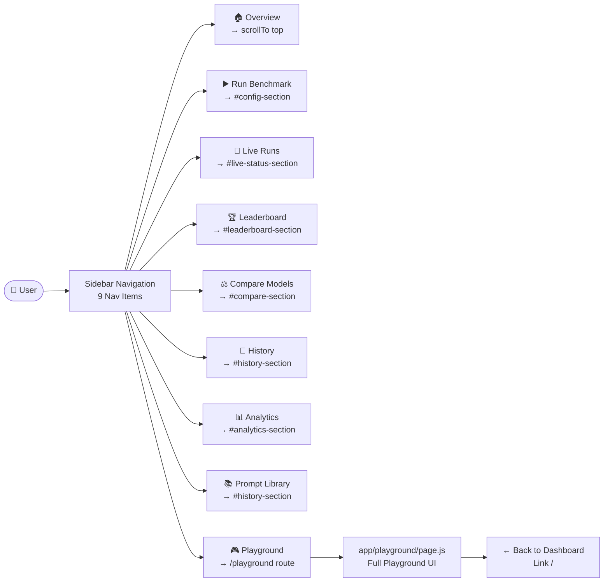

---

## 4. Configuration & API Key Setup

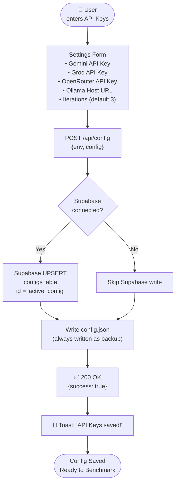

---

## 5. Complete Benchmark Execution Pipeline

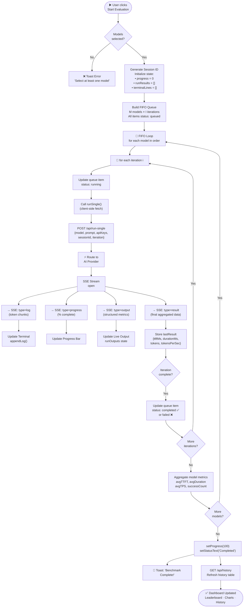

---

## 6. AI Provider Routing & Retry Logic

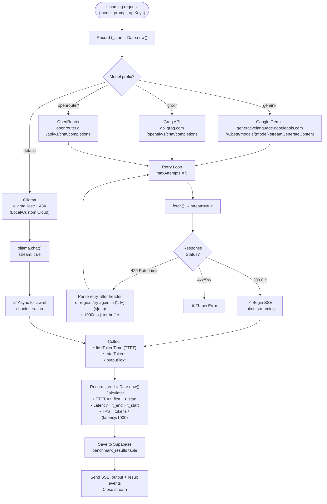

---

## 7. Real-Time SSE Stream Data Flow

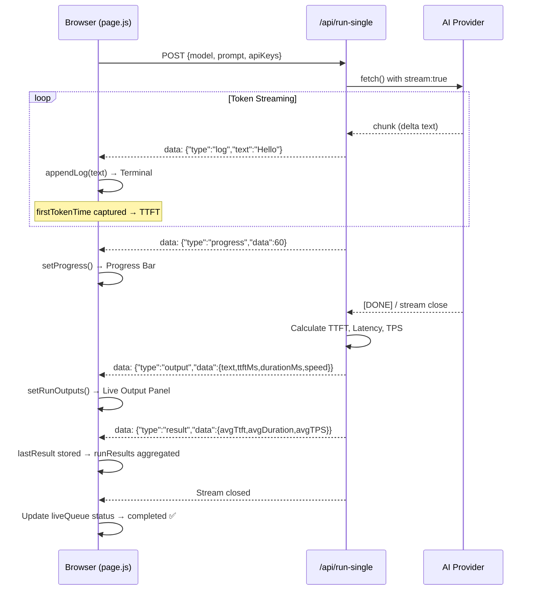

---

## 8. Playground Page Flow

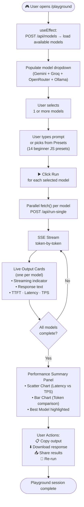

---

## 9. Data Persistence — 3-Tier Fallback Strategy

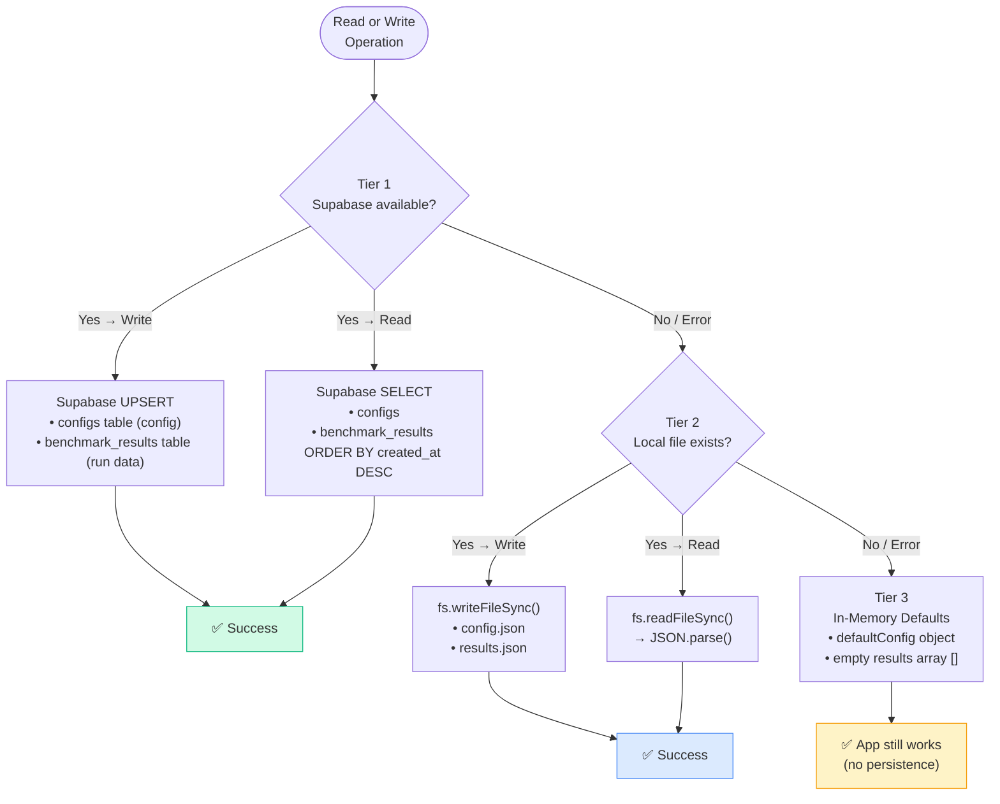

---

## 10. Analytics, Charts & Export Flow

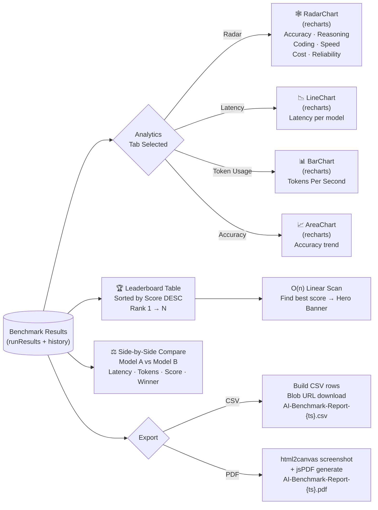

---

## 11. Core Algorithms Integration Map

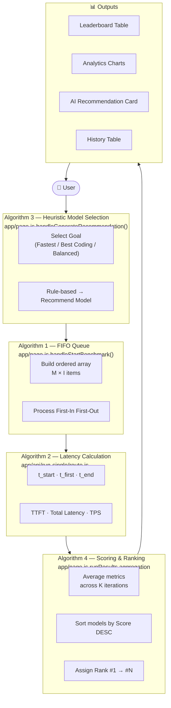

---

## 12. Complete One-Page System Summary

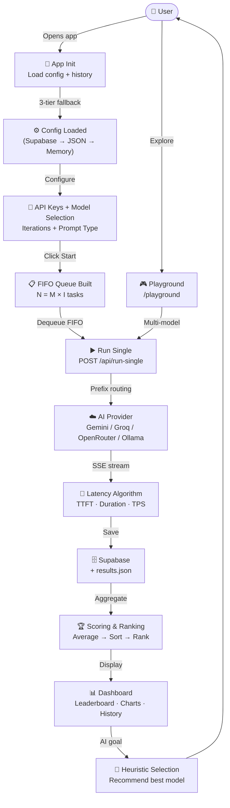
