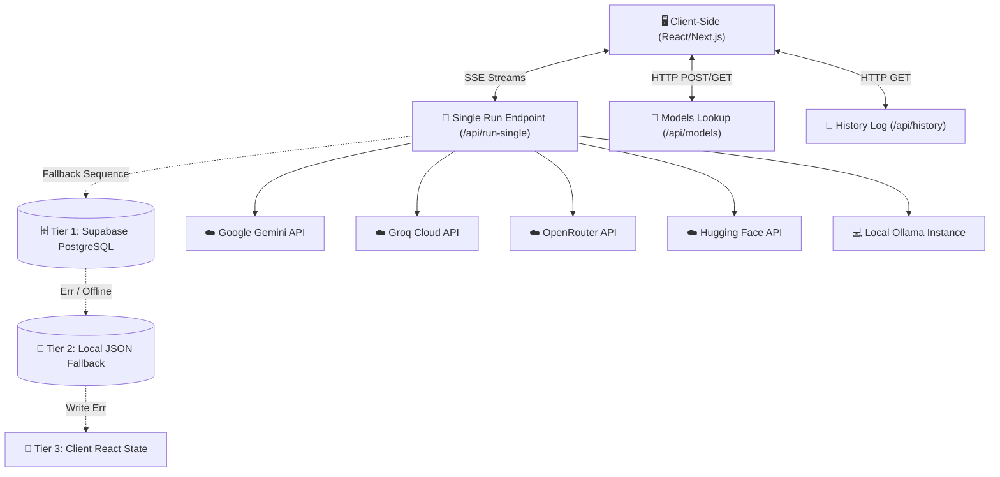

# Technical System Documentation: AI Benchmark Analyzer

This document provides a comprehensive technical breakdown of the **AI Benchmark Analyzer** platform, detailing the frontend architecture, backend endpoints, database persistence layers, mathematical formulas, system algorithms, and supported AI providers.

---

## 1. High-Level System Architecture

The platform is built using a modern decoupled design utilizing Next.js (App Router), styled with custom-tailored CSS variables for a premium glassmorphic dark-mode look, and integrated with a multi-tier persistence pipeline.



---

## 2. Frontend Architecture (UI Layer)

The frontend uses Next.js Client Components with responsive flex layouts, dynamic chart components, and live state synchronization.

### Key Components & Features
* **Main Dashboard Overview (`app/page.js`)**: 
  * Displays aggregated performance cards, interactive radar metrics, leaderboard comparisons, and history logs.
  * Implements dynamic **pulsing skeletons** to mask initial API load latencies.
* **Model Playground (`app/playground/page.js`)**:
  * Allows live side-by-side prompt execution.
  * Features an **expandable System Persona Prompt editor** and a **JavaScript Presets library**.
  * Displays a real-time **Live Benchmark Status** section tracking running models and active progress meters.
  * Features a **responsive model list drawer modal** for mobile view selectors.
* **Cross-Tab Synchronization**: 
  * Utilizes a Web `BroadcastChannel` (`'live-benchmark-channel'`) to broadcast queue updates in real time. Active playground evaluations immediately reflect on open Dashboard tabs.
* **Interactive Charts**:
  * Utilizes `Recharts` for high-performance rendering.
  * Includes customized tooltip styling, vertical linear gradient fills, and rounded column corners.

---

## 3. Backend Architecture (API Endpoints)

The serverless API endpoints orchestrate requests, transform stream buffers, and query data stores.

### 3.1 Single Run Endpoint (`/api/run-single`)
* Dispatches incoming prompts to the matching LLM provider.
* Calculates connection timing, formats the outputs into standard JSON payloads, and returns a live `text/event-stream` stream.

### 3.2 Dynamic Models Lookup (`/api/models`)
* Scans configured environment variables, local flat files, and Supabase config tables.
* Makes direct calls to local **Ollama** hosts and **OpenRouter** API lists to dynamically register active models.

### 3.3 Historical Log Endpoint (`/api/history`)
* Pulls historical benchmark records from the Supabase database to populate leaderboard stats and historical charts.

---

## 4. Supabase Database & Multi-Tier Persistence

The platform utilizes a **Three-Tier Failover Architecture** to ensure that benchmark logs are never lost due to offline operations or missing API keys.

```
                  [ Run Metric Generated ]
                             │
                             ▼
     ┌──────────────────────────────────────────────┐
     │ Tier 1: Supabase Cloud (PostgreSQL)          │ ──► Success (Saved to cloud)
     └──────────────────────┬───────────────────────┘
                            │ (Network Timeout / Conn Error)
                            ▼
     ┌──────────────────────────────────────────────┐
     │ Tier 2: Local JSON Backup Storage            │ ──► Success (Saved to results.json)
     └──────────────────────┬───────────────────────┘
                            │ (Write Permission / FS Error)
                            ▼
     ┌──────────────────────────────────────────────┐
     │ Tier 3: In-Memory Client State               │ ──► Saved in local React memory
     └──────────────────────────────────────────────┘
```

### Table Schema Details

#### 1. `configs` Table
Stores operational settings and API provider configurations:
* `id` (text, Primary Key): Typically `active_config`.
* `env` (jsonb): Stores encrypted/configured API keys (Gemini, Groq, OpenRouter, Ollama host URLs).
* `config` (jsonb): Model availability metadata and default selection weights.

#### 2. `benchmark_runs` Table
Stores telemetry logs for every single model evaluation:
* `id` (uuid, Primary Key): Unique evaluation ID.
* `model` (text): Full identifier string of the model.
* `prompt` (text): Input prompt text.
* `output` (text): Generated response text.
* `latency_ms` (integer): Total wall clock connection lifetime.
* `ttft_ms` (integer): Time to First Token.
* `tps` (numeric): Token throughput speed (Tokens/sec).
* `status` (text): `completed`, `failed`, or `stopped`.
* `created_at` (timestamptz): Timestamp of execution.

---

## 5. Mathematical Formulations & Metrics

To capture precise performance profiles, the platform calculates latency and speed metrics using the following definitions:

### 5.1 Time to First Token ($TTFT$)
Measures network handshake and initial inference latency before token generation begins:
$$TTFT \text{ (ms)} = t_{\text{first}} - t_{\text{start}}$$
*Where $t_{\text{start}}$ is the epoch millisecond timestamp recorded right before making the HTTP call, and $t_{\text{first}}$ is the timestamp of the first non-empty decoded chunk.*

### 5.2 Total Wall Clock Duration ($D$)
Measures the overall execution lifetime from the client's perspective:
$$D \text{ (ms)} = \max(1, t_{\text{end}} - t_{\text{start}})$$
*Where $t_{\text{end}}$ is the timestamp of connection closure.*

### 5.3 Pure Generation Duration ($T_{\text{gen}}$)
Isolates connection overhead to calculate accurate throughput speed:
$$T_{\text{gen}} \text{ (seconds)} = \max\left(0.05, \frac{D - TTFT}{1000}\right)$$

### 5.4 Token Throughput Speed ($TPS$)
Measures text generation velocity:
$$TPS \text{ (Tokens/sec)} = \frac{N_{\text{tokens}}}{T_{\text{gen}}}$$

#### Token Count Quantification ($N_{\text{tokens}}$)
If the model provider fails to supply native token usage metadata in the payload, the system falls back to a standardized character-to-token ratio heuristic:
$$N_{\text{tokens}} = \max\left(15, \left\lfloor \frac{\text{length}(S_{\text{output}})}{4} \right\rfloor\right)$$

### 5.5 Multi-Dimension Performance Score
Standardizes different variables (speed, cost, latency, reliability) into a unified overall score ($S \in [0, 100]$):
$$S = W_{\text{speed}} \cdot S_{\text{speed}} + W_{\text{latency}} \cdot S_{\text{latency}} + W_{\text{reliability}} \cdot S_{\text{reliability}}$$
*Normalized parameters are scaled against global minimums and maximums across all models to ensure relative positioning.*

---

## 6. Algorithmic Workflows & Logic

### 6.1 Multi-Provider Routing Logic
The core endpoint `/api/run-single` analyzes the model string prefix:
* **`gemini-*`** $\rightarrow$ Dispatches via `GoogleGenAI` library stream interfaces.
* **`groq/*`** $\rightarrow$ Routes via Groq Chat Completions endpoint.
* **`openrouter/*`** $\rightarrow$ Maps via OpenRouter gateway.
* **`huggingface/*`** $\rightarrow$ Passes to Hugging Face serverless Inference API.
* **Ollama/Custom** $\rightarrow$ Resolves to local Ollama API instances.

### 6.2 SSE Streaming State Parser & Buffer
Client-side stream handlers read raw buffers iteratively. To prevent decoding crashes from partial chunks, a string buffer accumulates text lines and parses them safely:
1. Decode raw bytes with `TextDecoder`.
2. Append to a local string buffer cache.
3. Split cache by newline delimiter `\n`.
4. Retain the incomplete trailing fragment in the buffer cache.
5. Parse completed data rows as JSON objects and dispatch to respective UI state arrays.

### 6.3 Iterative Batch Execution Queue
Iterative model benchmarking implements concurrency controls:
* **Concurrency Model**: Iterations of the same model run sequentially to avoid triggering API rate limit blocks, while different models evaluate in parallel.
* **Progress Formula**:
  $$\text{Progress \%} = \min\left(100, \left\lfloor \frac{C_{\text{completed}}}{M \cdot I} \times 100 + \frac{P_{\text{stream}}}{M \cdot I} \right\rfloor\right)$$
  *Where $C_{\text{completed}}$ is the number of completed iteration runs, $M$ is total models, $I$ is total iterations, and $P_{\text{stream}}$ is the stream percentage of the active model.*

### 6.4 Rate Limiting & Retry Backoffs
In the event of HTTP `429` (Rate Limited), the backend extracts retry metrics:
* **Gemini**: Inspects the response error object for `retryDelaySeconds`.
* **Groq / OpenRouter**: Scans the `retry-after` header or uses regex parsing on the error body text (`try again in X seconds`).
* Enforces an exponential backoff sequence capped at $5$ maximum attempts.

### 6.5 Offline Simulation Fallback
If API keys are missing or provider endpoints are down, the handler activates a fallback simulation:
1. Category lookup extracts response template matching the query type.
2. Segments text into 8-character chunks.
3. Streams chunks sequentially back to client using a randomized delay jitter:
   $$\text{Delay}_{\text{jitter}} = 30\text{ms} + \text{Random}(0, 30\text{ms})$$

---

## 7. Supported AI Providers & Models

The platform registers and benchmark-runs models across five distinct provider layers:

1. **Google Gemini**:
   * *Models*: `gemini-3.5-flash`, `gemini-2.5-pro`
   * *Focus*: Advanced coding, structured reasoning, and high accuracy.
2. **Groq API**:
   * *Models*: `llama-3.3-70b-versatile`, `llama-3.1-8b-instant`
   * *Focus*: Ultra-low TTFT latency and blazing throughput speeds.
3. **OpenRouter API**:
   * *Models*: Automatically queries OpenRouter's dynamic model catalog, filtering and registering the top free cloud model variants.
4. **Hugging Face API**:
   * *Models*: `Llama-3.1-8B-Instruct`, `Qwen2.5-7B-Instruct`, `DeepSeek-V3`
   * *Focus*: Open-weights model execution and compliance testing.
5. **Ollama (Local / Private Cloud)**:
   * *Models*: Dynamic local catalog (e.g. `ollama/llama3`, `ollama/mistral`, etc.).
   * *Focus*: Offline evaluations, local workstation benchmarking, and privacy.
