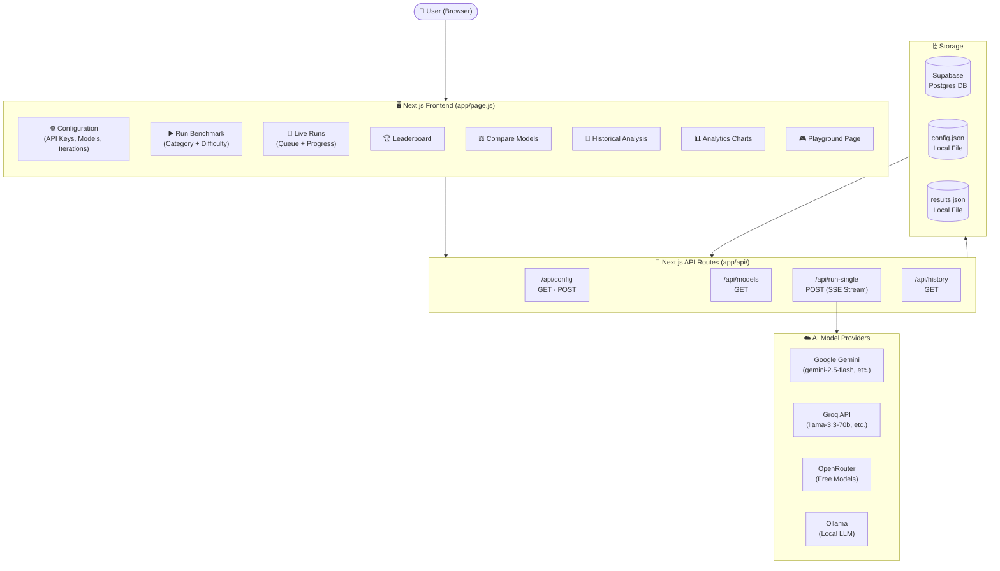
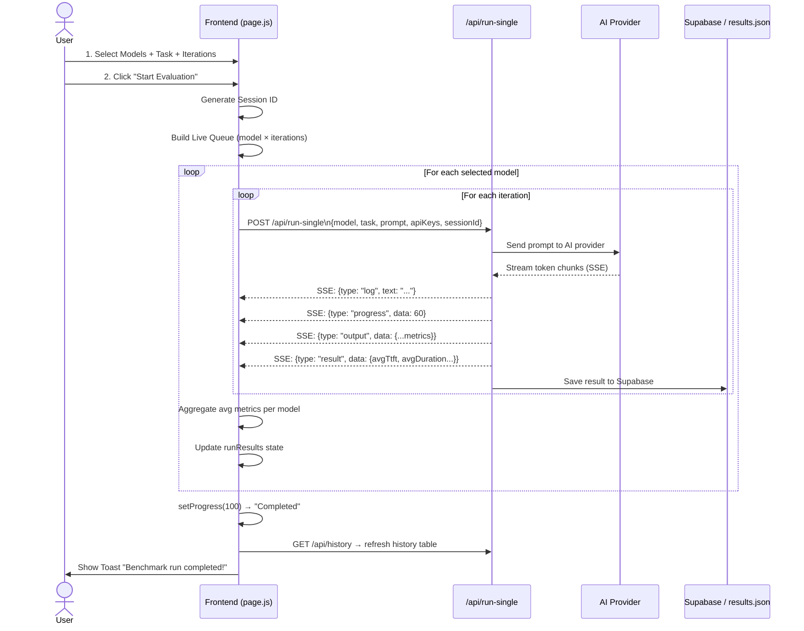
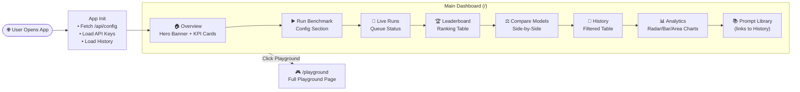
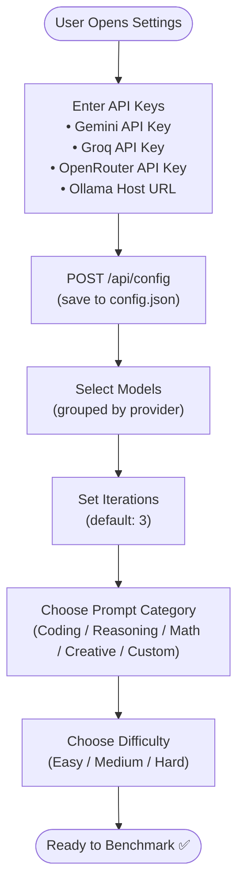
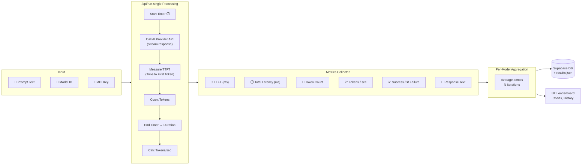
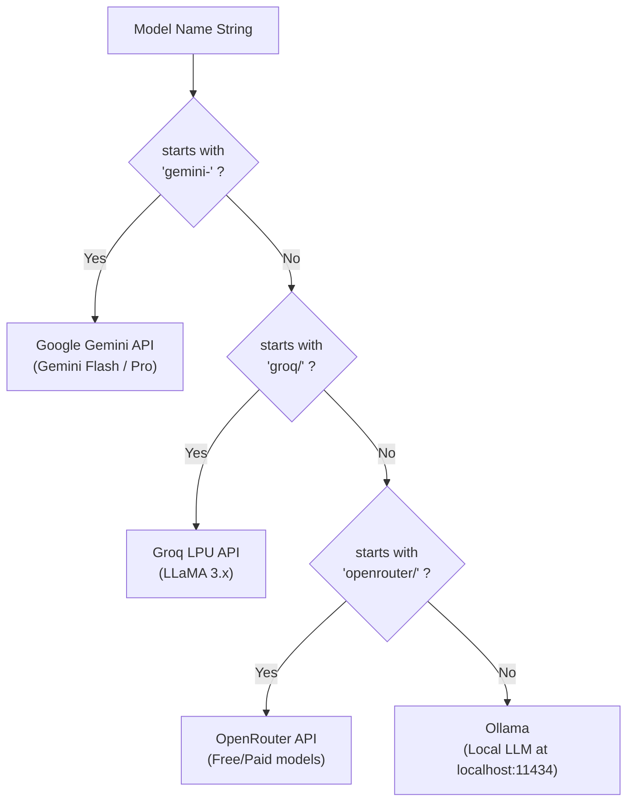
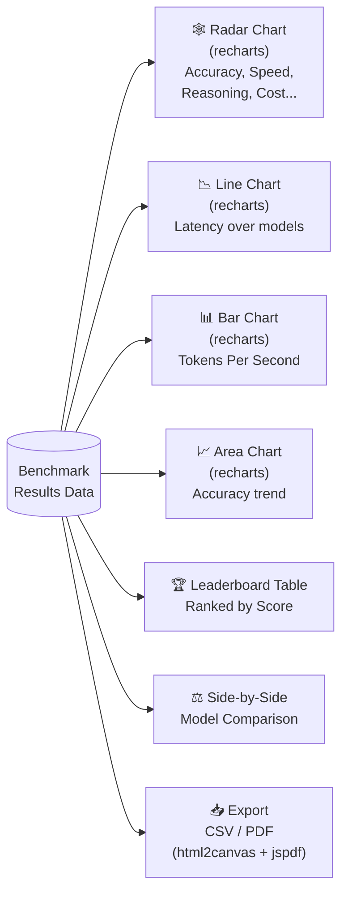
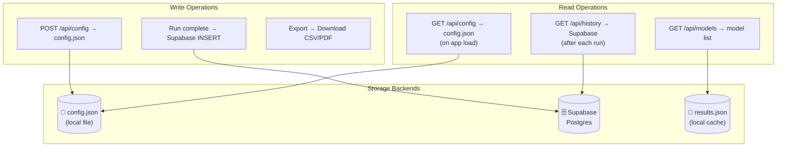

# AI Benchmark Analyzer — Workflow Diagram

> A complete end-to-end visual of how the system works, from configuration to results.

---

## 🗺️ High-Level System Architecture

---

## 🔄 Core Benchmark Execution Flow

---

## 🧭 Navigation & Page Flow

---

## ⚙️ Configuration & Setup Flow

---

## 📊 Data & Metrics Pipeline

---

## 🤖 AI Provider Routing Logic

---

## 📈 Analytics & Visualization Flow

---

## 🗄️ Storage & Persistence

